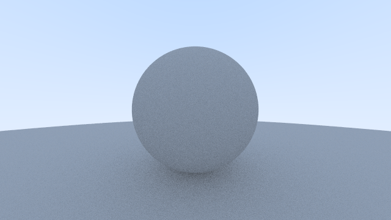

# raytracer

Implements a raytracer based on the book [_Ray Tracing in One Weekend_](https://raytracing.github.io/books/RayTracingInOneWeekend.html). 

## How to build

*Windows*

Open git bash to the directory containing this repository.

```
raytracer $ mkdir build
raytracer $ cd build
raytracer/build $ cmake -G "Visual Studio 16 2019" ..
raytracer/build $ start CS312-Raytracer.sln
```

Your solution file should contain multiple projects, such as `gradient` and `normals`.
To run from the git bash command shell, 

```
raytracer/build $ ../bin/Debug/gradient
raytracer/build $ ../bin/Debug/normals
```

*macOS*

Open terminal to the directory containing this repository.

```
raytracer $ mkdir build
raytracer $ cd build
raytracer/build $ cmake ..
raytracer/build $ make
```

To run each program from build, you would type

```
raytracer/build $ ../bin/gradient
raytracer/build $ ../bin/normals
```

**Lambertian Material**



**Materials**


**Unique Features**

Unique feature implemented: Defocus Blur.
Unique image ideas used: changing the background color, using circles and boxes, changing the camera position, and applying defocus blur.


Defocus Blur:

